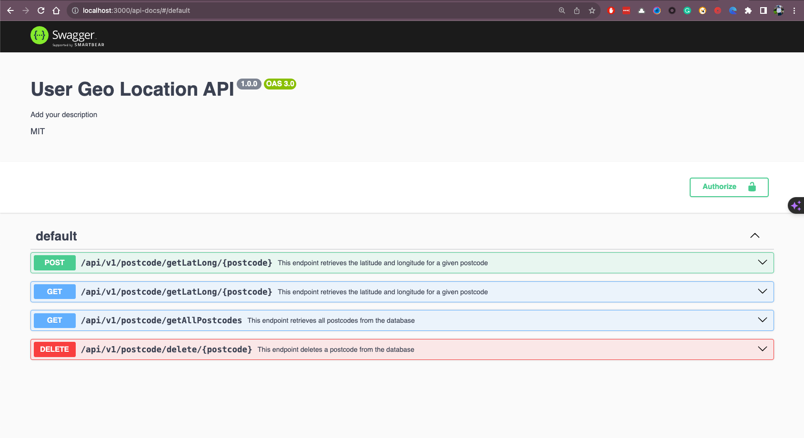

# User geo coordinates API

## Description

This is a simple API that returns the geo coordinates of a user based on the postcode provided.

## Installation

```bash
npm install express axios body-parser cors express helmet morgan
```

### Development

To run the app in development mode, run the following commandm which will start the mongodb instance and the app.

```bash
docker-compose up -d
```
Build the Docker image for local development
    
```bash
docker build -t user-geo-coordinates-api .
```

### Project structure

```bash
your-app/
│
├── src/
│   ├── models/                # Mongoose models / schemas.
│   │   └── ...
│   ├── routes/                # Express route definitions.
│   │   └── ...
│   ├── services/              # Business logic and service layer.
│   │   ├── postcodeService.js # Service for handling postcode-related operations.
│   │   └── externalApi.js     # This is where you'd interact with external APIs.
│   ├── config/                # Configuration files.
│   │   └── ...
│   ├── utils/                 # Utility functions and helpers.
│   │   └── ...
│   ├── middleware/            # Custom middleware for Express.
│   │   └── ...
│   ├── app.js                 # Express app setup.
│   └── server.js              # Server entry point.
│
├── package.json               # Project manifest.
└── ...
```
### Build Docker image

Using github actions, the docker image is built and pushed to docker hub.

```bash
docker run -p 3000:3000 -d \
  -e MONGO_INITDB_ROOT_USERNAME=newadmin \
  -e MONGO_INITDB_ROOT_PASSWORD=newpassword \
  -e MONGO_HOST=host.docker.internal \
  -e MONGO_PORT=27017 \
  -e MONGO_DB=newdatabase \
  your-app-name
```

### 🎨 API Documentation 

The API documentation is available at [http://localhost:3000/api-docs](http://localhost:3000/api-docs)



### 📝 Deployment

Docker image is deployed to kubernetes cluster using github actions and helm.


